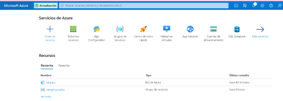
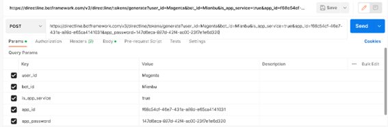
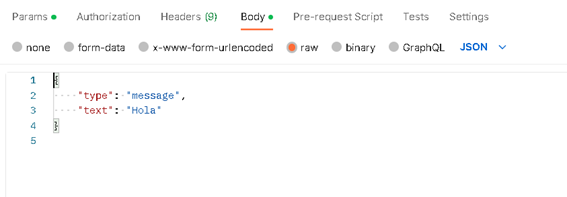

## Ejemplo para Invocar al Bot Framework con Webhooks

En este ejemplo invocaremos al Bot Framework utilizando Webhooks usando la herramienta Postman para enviar solicitudes HTTP POST a la API de Bot Framework.

*Crear bot ya configurado

*Seleccionar el método "POST" HTTP de la solicitud.
Ingresa la URL del servidor

*Enviamos el cuerpo de la solicitud

*Y enviamos la solicitud

